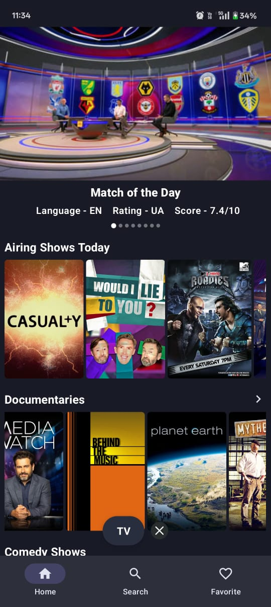

## 🎬 CineSuggest – Movie & TV Show Recommendation App


CineSuggest is an Android app that helps users discover movies and TV shows based on various genres. Users can search for movies, mark them as favorites, and view detailed information such as ratings, release date, language, genres, and vote count.

The app features a splash screen for a smooth startup experience, Lottie animations for enhanced UI interactions, and multiple APIs to fetch real-time movie data. It follows MVVM Clean Architecture with Room Database, Retrofit, Dagger Hilt, and Coil for an optimized and scalable design.

## 🚀 Features
- Splash Screen with Lottie animations for a smooth startup
- Recommends Movies and TV Shows based on their genres and displaying them using various API's
- Search Movies keyword 
- Mark Favorites and store them using Room Database
- Detailed Movie Information (Overview, Ratings, Release Date, Language, Genres, and Vote Count)
- Material 3 Design for a modern and sleek UI
- Offline Support with Room Database

## 📷 Screenshots and Previews

<p align="left"> 
    &nbsp; &nbsp; &nbsp;
    &nbsp; &nbsp; &nbsp;
    &nbsp; &nbsp; &nbsp;
</p>
<p align="left"> 
       &nbsp; &nbsp; &nbsp;
    &nbsp; &nbsp; &nbsp;
     &nbsp; &nbsp; &nbsp;
</p>
<p align="left"> 
       &nbsp; &nbsp; &nbsp;
       &nbsp; &nbsp; &nbsp;
    &nbsp; &nbsp; &nbsp;
</p>
<p align="left"> 
     &nbsp; &nbsp; &nbsp;
    &nbsp; &nbsp; &nbsp;
       &nbsp; &nbsp; &nbsp;
</p>


## 📂 Source Code
Check out the complete source code here:
👉 **[GitHub Repository](https://github.com/jacky8381/MoviesApp)**

## 🎥 Demo
Watch the video demo of CineSuggest in action:
👉 **[Video Demo](https://drive.google.com/file/d/1uvyGikv6UyfIWIcmskRX0fjTLvdJamks/view?usp=drivesdk)**

## 🛠️ Technologies Used
- **Kotlin + MVVM Clean Architecture**
- **Jetpack Compose**
- **Room Database for offline storage**
- **Retrofit for API integration**
- **Dagger Hilt for dependency injection**
- **Coil for image loading**
- **Lottie Animations for a better UI experience**
- **Material Theme 3 for UI**


## 📜 How to Run
1. Clone the repository:
   ```sh
   git clone https://github.com/jacky8381/MoviesApp.git
2. Open the project in Android Studio.
3. Sync the Gradle files and build the project.
4. Run the app on an emulator or a physical device.
